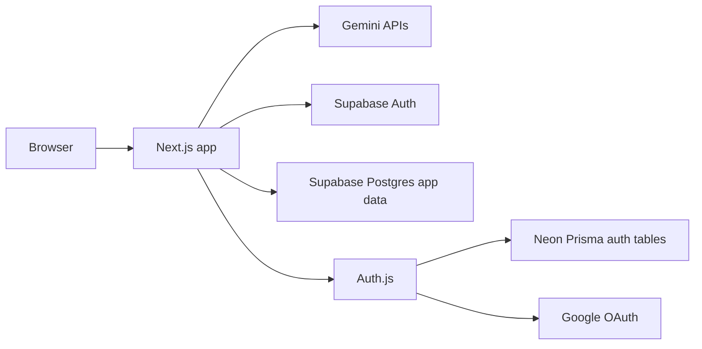
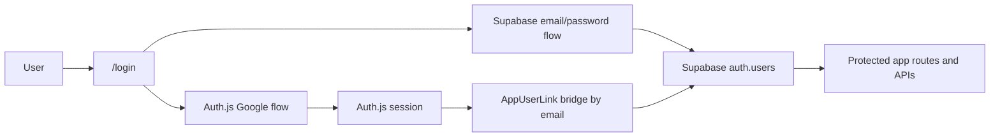
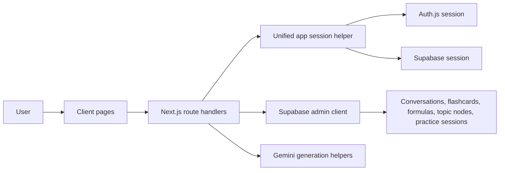

# UniMathMate

UniMathMate is an AI-assisted study workspace for university mathematics. It combines tutoring chat, practice generation, flashcards, formula sheets, a knowledge map, and study history into one Next.js app.

## Features

- Chat tutor with math rendering and optional image-assisted prompts
- Topic-based practice generation with saved practice history
- AI-generated formula sheets with PDF export
- Flashcard deck generation and deck viewer
- Knowledge map driven by classified practice activity
- Hybrid auth:
  - Supabase Auth for email/password signup, verification, login, and reset
  - Auth.js + Google on your own domain for Google sign-in
- Dark theme editorial-style UI

## Tech Stack

- Framework: Next.js 16 App Router + TypeScript
- Styling: Tailwind CSS v4
- AI: Gemini via `@google/genai`
- App data: Supabase Postgres
- Local auth: Supabase Auth
- Google auth: Auth.js + Prisma + Neon
- ORM for Auth.js tables: Prisma 7 + `@prisma/adapter-neon`
- Math rendering: KaTeX + `react-markdown` + `remark-math` + `rehype-katex`
- Graph UI: `@xyflow/react`
- Animation: Framer Motion

## Architecture

### High-level systems



### Auth interaction



### App data flow



## Authentication Model

UniMathMate currently uses a hybrid auth setup.

- Email/password signup, verification, forgot password, and reset password are handled by Supabase Auth.
- Google sign-in is handled by Auth.js so the OAuth flow runs on your own domain.
- Protected app routes use a unified server session abstraction that accepts either:
  - an Auth.js Google session, or
  - a Supabase local-auth session
- Google users are bridged back to a canonical Supabase app user id through `AppUserLink`, so both auth paths can access the same Supabase-backed app data.

## Setup

### 1. Install dependencies

```bash
cd unimath
npm install
```

### 2. Configure Supabase

1. Create a Supabase project.
2. Run [`supabase/schema.sql`](supabase/schema.sql) in the Supabase SQL editor.
3. Enable email/password auth in Supabase Auth.
4. Configure email templates / SMTP in Supabase if you want production email delivery for verify/reset flows.

Recommended Supabase redirect URLs:

- `http://localhost:3000/auth/callback`
- `http://localhost:3000/reset-password`
- `https://www.unimathmate.com/auth/callback`
- `https://www.unimathmate.com/reset-password`

### 3. Configure Neon

Create a Neon project for Auth.js/Prisma tables only.

- Do not enable Neon Auth for this repo.
- Copy the Postgres connection string into `AUTH_DATABASE_URL`.

### 4. Configure Google OAuth

Create a Google OAuth web application and add:

- Authorized JavaScript origins:
  - `http://localhost:3000`
  - `https://www.unimathmate.com`
- Authorized redirect URIs:
  - `http://localhost:3000/api/auth/callback/google`
  - `https://www.unimathmate.com/api/auth/callback/google`

### 5. Configure environment variables

Use `.env` for local development in this repo so both Next.js and Prisma can read the same values.

Minimum local env:

```env
NEXT_PUBLIC_SUPABASE_URL=
NEXT_PUBLIC_SUPABASE_ANON_KEY=
SUPABASE_SERVICE_ROLE_KEY=

GEMINI_API_KEY=

AUTH_DATABASE_URL=
AUTH_SECRET=
AUTH_GOOGLE_ID=
AUTH_GOOGLE_SECRET=
NEXTAUTH_URL=http://localhost:3000
```

Notes:

- `SUPABASE_SERVICE_ROLE_KEY` is server-only and must never be exposed to the browser.
- `AUTH_SECRET` should be a stable random secret, for example from `openssl rand -base64 32`.
- `NEXTAUTH_URL` avoids Auth.js local warnings.

### 6. Generate Prisma client and migrate Neon auth tables

```bash
npm run prisma:generate
npm run prisma:migrate:auth
```

Optional:

```bash
npm run prisma:studio
```

### 7. Run the app

```bash
npm run dev
```

Open [http://localhost:3000](http://localhost:3000).

## Recommended Smoke Tests

After setup, test:

1. Visit `/login`
2. Register a new email/password account
3. Verify email from the Supabase email link
4. Sign in with email/password
5. Sign in with username/password
6. Request a password reset and update the password
7. Sign in with Google
8. Confirm both auth paths can reach `/dashboard`
9. Confirm dashboard, chat, flashcards, formulas, practice, map, and history load normally

## Useful Scripts

```bash
npm run dev
npm run build
npm run start
npm run lint
npm run prisma:generate
npm run prisma:migrate:auth
npm run prisma:deploy:auth
npm run prisma:studio
```

## Project Structure

```text
src/
  app/
    page.tsx
    layout.tsx
    login/page.tsx
    reset-password/page.tsx
    auth/callback/route.ts
    (app)/
      layout.tsx
      dashboard/page.tsx
      chat/page.tsx
      chat/[id]/page.tsx
      practice/page.tsx
      formulas/page.tsx
      flashcards/page.tsx
      flashcards/[id]/page.tsx
      history/page.tsx
      map/page.tsx
      settings/page.tsx
    api/
      auth/[...nextauth]/route.ts
      auth/resolve-identifier/route.ts
      app-session/route.ts
      chat/route.ts
      conversations/[id]/route.ts
      dashboard/route.ts
      flashcards/route.ts
      flashcard-decks/route.ts
      flashcard-decks/[id]/route.ts
      formulas/route.ts
      formula-sheets/route.ts
      formula-sheets/[id]/route.ts
      history/route.ts
      practice/route.ts
      practice-sessions/route.ts
      topic-nodes/route.ts
      topics/classify/route.ts
  components/
    auth-session-provider.tsx
    editorial.tsx
    flashcard-deck-viewer.tsx
    landing-flashcard.tsx
    math-renderer.tsx
    sidebar.tsx
    topic-autocomplete.tsx
    visual-equation-button.tsx
    ui/
  lib/
    auth/
      app-user.ts
      options.ts
      session.ts
      use-app-session.ts
    supabase/
      admin.ts
      auth-user-lookup.ts
      client.ts
      server.ts
    prisma.ts
    gemini.ts
    document-text.ts
    topics.ts
    types.ts
```

## Current Caveats

- Supabase app data still relies on a server-side admin client plus manual user scoping; the app is not yet fully reduced to a single auth provider.
- Google and local auth are intentionally hybrid right now.
- The remaining lint warnings are unrelated to auth and come from raw `` usage in the chat pages.
